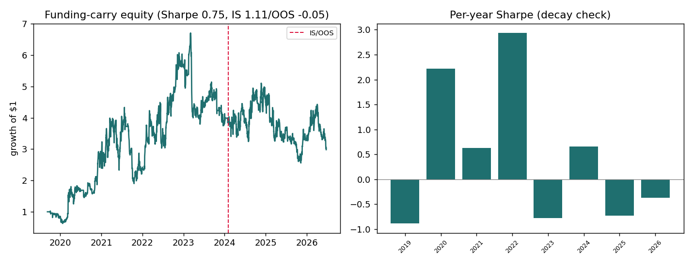

# Project 6 — Crypto Funding-Carry

**Skill demonstrated:** signal research on a *novel data source* (perpetual-futures funding rates) most candidates ignore, plus honest decay diagnosis. **Data:** Binance BTC perpetual funding + perp price, 8-hourly, 2019–2026. **Reproduce:** `python run.py`.

## Hypothesis (stated first)

The perpetual funding rate is the price of leverage. When funding is high, longs are crowded and pay shorts; the crowded side tends to mean-revert, so **fading extreme funding — while collecting the funding — is a carry premium.** Tested two ways: (1) does funding predict the next period's return? (2) does a funding-fade carry strategy survive net of cost?

## Results (real, from `run.py`, 4,221 eight-hour periods)

| Metric | Value |
|---|---|
| Average funding (annualized) | **+11.9%** — the carry premium is structurally large and positive |
| corr(funding-z, next-period return) | **−0.038** — weakly thesis-consistent (crowded longs under-perform) |
| Carry strategy Sharpe (full / IS / OOS) | 0.75 / **1.11** / **−0.05** |
| Sharpe block-bootstrap 95% CI | [−0.20, 1.72] — straddles zero |
| Per-year Sharpe | 2020 +2.2, 2022 +2.9 … **2023 −0.8, 2025 −0.7, 2026 −0.4** |

## Verdict — a real premium, a decayed edge

The funding *premium* is unambiguously real (BTC perp funding averaged **+11.9% annualized** — longs structurally pay shorts). But the *tradeable* funding-fade **decayed**: strong in the wild early era (2020 +2.2, 2022 +2.9 Sharpe), it turned negative post-2023 (IS 1.11 → OOS −0.05), and the full-sample bootstrap CI straddles zero. This is the textbook "an edge that worked in immature, inefficient markets erodes as the market matures and arbitrage capital arrives" — and the honest conclusion is *"a real structural premium that is no longer cleanly harvestable net of cost on this venue,"* not "Sharpe 1.11." The deliverable is the novel-data signal construction *and* the era-decomposition that catches the decay.
